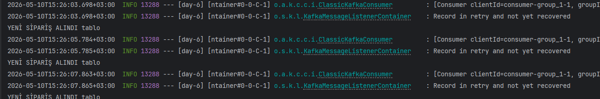
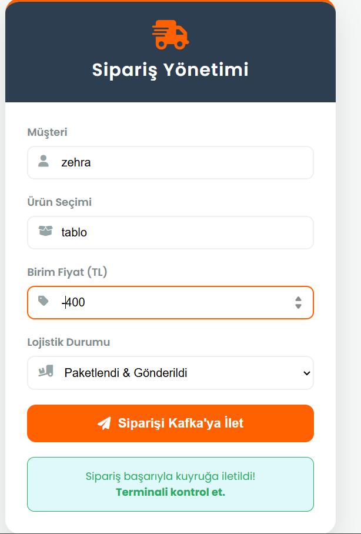

Bu proje, Kafka öğrenme yolculuğumun 6. gününde geliştirilmiştir. Temel amaç, bir e-ticaret senaryosu üzerinden Hata Yönetimi (Error Handling), Yeniden Deneme Mekanizması (Retry Logic) ve Hatalı Mesaj Kuyruğu (Dead Letter Topic - DLT) kavramlarını uygulamalı olarak öğrenmektir.

Hatalı veride sistemin otomatik olarak 3 kez tekrar deneme (Retry) süreci.

