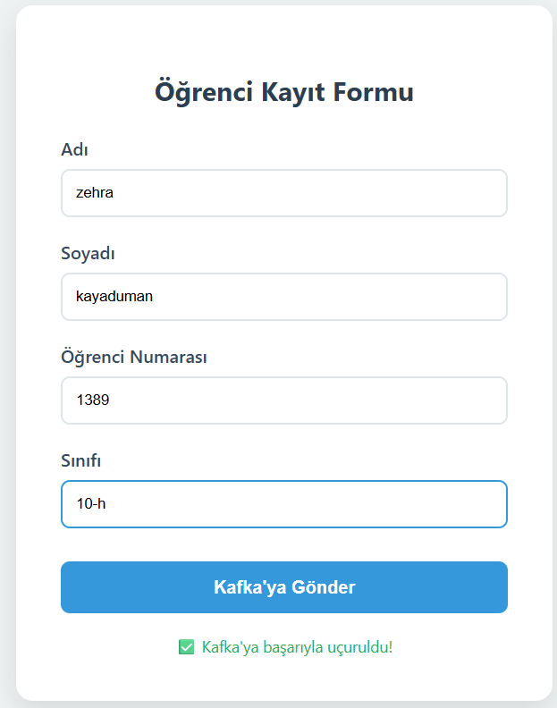
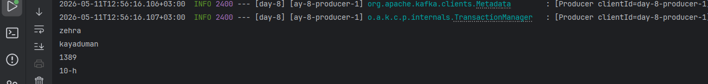

## Kafka Java Object Serialization (KAFKA-EX-03)

Bu proje, Apache Kafka üzerinden Java Nesnelerinin (POJO) JSON formatında serileştirilerek transfer edilmesini kapsayan bir alıştırmadır.

# Görev Özeti
StudentDto sınıfı oluşturuldu (id, ad, soyad, numara, sınıf).

Producer: Java nesnesini JSON olarak topicStudent konusuna yayınlar.

Consumer: Gelen veriyi tekrar Java nesnesine dönüştürerek konsola yazdırır.

