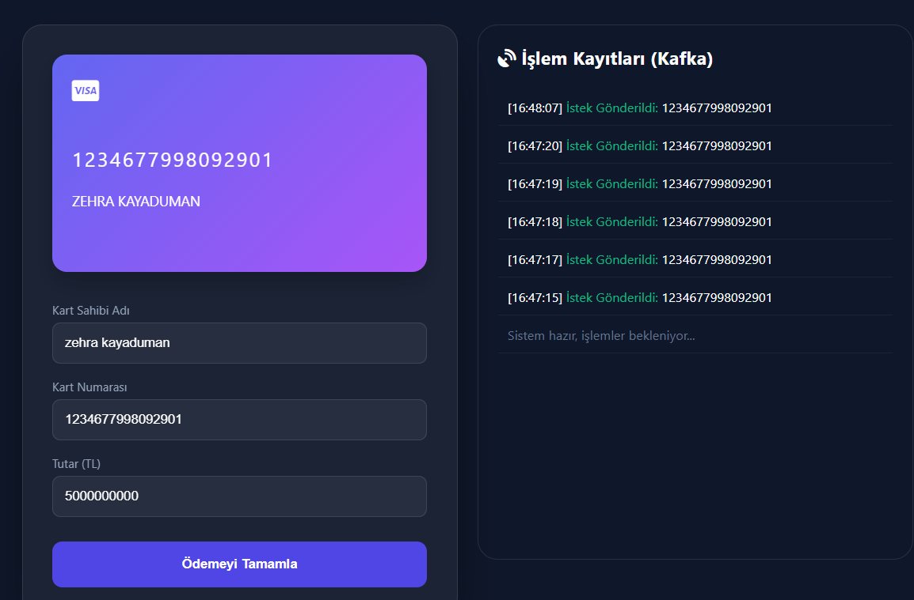
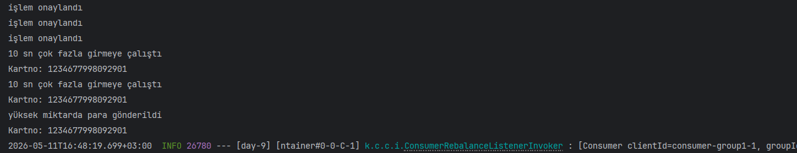

## Akıllı Dolandırıcılık Tespit Sistemi
Bu proje, bir ödeme sisteminde "hız" ve "güvenlik" dengesini nasıl kurabileceğimizi gösteren, Kafka tabanlı bir akıllı denetleme motorudur. Veriyi bir veritabanına kaydedip sonra analiz etmek yerine, veri akarken anlık kararlar alan dinamik bir yapı sunar.

Arayüz üzerinden gönderilen anlık ödeme isteklerinin, Kafka Consumer tarafından analiz edilip hız ve tutar limitlerine göre filtrelenme süreci.

